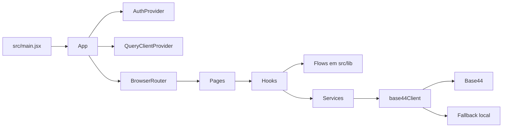

# Fluxo de Dados

## Visao geral

## Bootstrap da aplicacao
- `src/main.jsx` renderiza `App` e carrega `src/index.css`.
- `src/App.jsx` envolve a aplicacao com `AuthProvider`, `QueryClientProvider`, `BrowserRouter` e `Toaster`.
- O `QueryClientProvider` ja esta disponivel, mas o carregamento das paginas ainda acontece com `useEffect` e `useState`, sem `useQuery`.

## Autenticacao e configuracao
- `src/lib/app-params.js` le `app_id`, `app_base_url`, `access_token` e `functions_version` da URL, do `localStorage` e do `.env`.
- `src/API/base44Client.js` escolhe entre tres fontes:
  - `globalThis.__B44_DB__`, usado em testes e ambientes injetados.
  - cliente real da Base44, quando `VITE_BASE44_APP_ID` existe.
  - `fallbackDb`, quando a Base44 nao esta configurada.
- `src/lib/AuthContext.jsx` primeiro carrega as configuracoes publicas da aplicacao na Base44 e, se houver token, consulta `db.auth.me()`.
- Tratamento de falhas de autenticacao:
  - `user_not_registered`: mostra `UserNotRegisteredError`.
  - `auth_required`: tenta redirecionar para login quando `app_base_url` estiver configurado.
  - fallback local: nao bloqueia o acesso para desenvolvimento de interface.

## Camadas canonicas
- `src/pages`: monta a tela, escolhe o estado visual e delega handlers.
- `src/hooks`: busca dados, coordena estado local e chama servicos e fluxos.
- `src/lib/*Flow.js`: contem regras de negocio, validacoes e comportamento transacional.
- `src/services`: concentra CRUD de entidades Base44 e integracoes externas.
- `src/components`: contem apresentacao reutilizavel, incluindo componentes de agenda e componentes base de UI.

## Fluxo do dashboard
- `src/pages/Dashboard.jsx` consome `useDashboardPage`.
- `src/hooks/useDashboardPage.js` busca em paralelo:
  - `listEmployees()`
  - `listSchedulesByPeriod({ month: atual, year: atual })`
  - `listScheduleRules()`
- O hook deriva:
  - total de colaboradores
  - quantidade de escalas no mes atual
  - quantidade de regras ativas
  - total de folgas somando `days`
- A pagina trata estados de carregamento, erro e vazio antes de renderizar os cards.

## Fluxo de colaboradores
- `src/pages/Employees.jsx` delega a logica para `useEmployeesPage`.
- `src/hooks/useEmployeesPage.js` carrega a lista inicial com `listEmployees()` e controla o dialogo de criacao/edicao.
- A validacao e normalizacao ficam em `src/lib/employeeFlow.js`:
  - remove espacos duplicados
  - converte nome para caixa alta
  - exige nome com pelo menos 3 caracteres
  - impede duplicidade por nome normalizado
  - restringe cargo ao enum `EMPLOYEE_ROLES`
- Persistencia:
  - novo colaborador: `createEmployee({ name, role, active: true })`
  - edicao: `updateEmployee(employee.id, payload)`
  - exclusao: `deleteEmployee(employee.id)`
- Depois de salvar ou excluir, o hook substitui a lista local pela resposta de `listEmployees()`.

## Fluxo de escala mensal
- `src/pages/Schedule.jsx` consome `useSchedulePage`.
- `src/hooks/useSchedulePage.js` busca em paralelo:
  - `listSchedulesByPeriod({ month, year })`
  - `listActiveEmployees()`
- O hook usa `analyzeSchedulesForMonth()` para classificar registros:
  - primarios validos por colaborador
  - duplicados do mesmo colaborador
  - escalas obsoletas de colaboradores inativos ou ausentes

### Geracao e regeneracao
- Ao gerar o periodo, `handleGenerate()` recarrega os dados do mes e chama `generateSchedulesForPeriod()`.
- `src/lib/scheduleFlow.js`:
  - cria um payload por colaborador ativo com todos os dias iniciando em `T`
  - atualiza a escala primaria existente quando houver
  - cria uma nova escala quando o colaborador ainda nao tem registro no periodo
  - remove duplicados e registros obsoletos ao final
  - executa rollback best effort se uma falha interromper a recriacao
- O retorno do fluxo informa se o periodo foi gerado, regenerado ou regenerado com falhas de limpeza.

### Edicao manual de turno
- O clique em celula chama `prepareScheduleDayUpdate()`, tambem em `src/lib/scheduleFlow.js`.
- A validacao garante:
  - existencia de `schedule.id`
  - existencia de `employee_id`
  - dia inteiro e dentro do mes
  - periodo da escala igual ao periodo exibido
- A transicao de turno segue `T -> F -> M -> T`.
- O hook aplica atualizacao otimista na UI, persiste com `updateScheduleDays()` e desfaz apenas a linha afetada se a chamada falhar.
- `pendingCellUpdates` evita multiplos cliques concorrentes na mesma celula.

## Fluxo de comandos em linguagem natural
- `src/pages/Commands.jsx` consome `useCommandsPage`.
- `src/hooks/useCommandsPage.js` carrega em paralelo:
  - `listEmployees()`
  - `listScheduleRules("-created_date", 20)`
  - `listSchedulesByPeriod({ month: atual, year: atual })`
- O historico de sessao fica apenas em memoria do navegador; nao e persistido.

### Aplicacao do comando
- `src/lib/commandFlow.js` valida o texto antes de chamar a IA:
  - comando obrigatorio
  - minimo de 8 caracteres
  - existencia de colaboradores
  - existencia de escalas no periodo
- `buildCommandPrompt()` monta o prompt com:
  - nomes e IDs dos colaboradores
  - `schedule_id` e `days` normalizados de cada escala
  - regras de interpretacao do periodo
- `services.invokeLlm()` chama `db.integrations.Core.InvokeLLM()` com schema JSON esperado.
- A resposta da IA passa por `validateLlmPayload()` e depois por `collectApplicableChanges()`, que descarta:
  - escalas inexistentes
  - dias fora do mes
  - turnos diferentes de `T`, `F` e `M`
  - blocos sem alteracoes validas
- Cada escala valida e persistida individualmente com `updateScheduleDays()`.
- So depois de ao menos uma atualizacao aplicada o sistema cria uma `ScheduleRule` com `rule_text`, `active` e `employee_name`.
- Excluir uma regra por `deleteRuleFlow()` remove apenas o registro da regra; a escala nao e revertida.

## Fluxo de exportacao
- `src/components/schedule/ExportButton.jsx` clona a grade para um sandbox temporario fora da viewport.
- O sandbox remove comportamentos de scroll e sticky para capturar a tabela inteira.
- `html2canvas` gera uma imagem PNG com largura baseada no conteudo real da grade.
- O nome do arquivo e higienizado por `sanitizeExportFileName()` em `src/lib/exportUtils.js`.

## Fronteiras externas e observacoes
- Todas as leituras e escritas acontecem no browser; nao existe uma camada backend propria neste repositorio.
- `Employee`, `Schedule` e `ScheduleRule` sao acessados diretamente via `db.entities`.
- A integracao de IA tambem e chamada diretamente do cliente via Base44.
- O modo fallback ajuda a desenvolver layout, mas nao valida autenticacao, persistencia real nem reprocessamento de regras.
- Regras salvas ainda funcionam como auditoria simples, nao como motor declarativo de recomposicao da escala.
