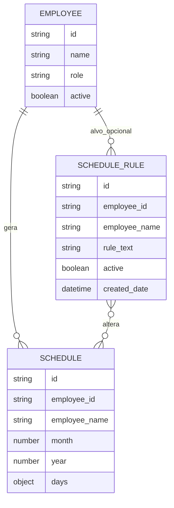

# Modelo de Entidades

## Escopo
Este documento formaliza o modelo de entidades atual do projeto `Escala 1.0` com base em:

- definicoes locais em `entidades/`
- uso efetivo do frontend em `src/pages/`
- regras operacionais observadas na geracao e manutencao de escalas

Ele descreve o estado atual do sistema, nao um desenho idealizado.

## Visao Geral



## Entidade `Employee`

### Finalidade
Representa um colaborador elegivel para participacao em escalas mensais.

### Definicao base
Origem: `entidades/Funcionário`

| Campo | Tipo | Obrigatorio | Default | Regra atual |
|---|---|---:|---|---|
| `name` | `string` | Sim | - | Nome do colaborador. O frontend persiste em caixa alta no fluxo atual. |
| `role` | `string` | Nao | - | Cargo do colaborador. A interface trabalha com enum fechado. |
| `active` | `boolean` | Nao | `true` | Define se o colaborador entra na geracao de novas escalas. |

### Valores esperados de `role`

- `Farmacêutico`
- `Atendente`
- `Gerente`
- `Caixa`
- `Outro`

### Metadados de plataforma usados pela aplicacao

| Campo | Tipo | Uso atual |
|---|---|---|
| `id` | `string` | Referencia principal em relacionamentos e operacoes CRUD. |

### Invariantes de negocio

- `name` e a chave humana principal do colaborador no fluxo operacional.
- Um colaborador com `active = true` deve ser considerado elegivel para geracao de escala.
- O sistema atual nao define unicidade formal para `name`, mas assume nomes distinguiveis para operacao manual e comandos IA.

## Entidade `Schedule`

### Finalidade
Representa a escala mensal consolidada de um colaborador para um determinado mes e ano.

### Definicao base
Origem: `entidades/Agendar`

| Campo | Tipo | Obrigatorio | Default | Regra atual |
|---|---|---:|---|---|
| `employee_id` | `string` | Sim | - | Referencia logica ao colaborador dono da escala. |
| `employee_name` | `string` | Sim | - | Snapshot textual do nome do colaborador no momento da geracao. |
| `month` | `number` | Sim | - | Mes de competencia, esperado no intervalo `1..12`. |
| `year` | `number` | Sim | - | Ano de competencia. |
| `days` | `object<string,string>` | Sim | - | Mapa de dias do mes para codigos de turno. |

### Estrutura esperada de `days`

- chaves: strings numericas de `1` ate o ultimo dia do mes
- valores:
  - `T` = Trabalho
  - `F` = Folga
  - `M` = Madrugada

Exemplo:

```json
{
  "1": "T",
  "2": "F",
  "3": "M"
}
```

### Metadados de plataforma usados pela aplicacao

| Campo | Tipo | Uso atual |
|---|---|---|
| `id` | `string` | Atualizacao, exclusao e reconciliacao de mudancas vindas da UI e dos comandos IA. |

### Invariantes de negocio

- A chave logica da entidade e `employee_id + month + year`.
- Deve existir no maximo uma escala por colaborador para cada combinacao de `mes/ano`.
- `days` deve cobrir todos os dias validos do periodo.
- `employee_name` e um campo desnormalizado para leitura rapida, exportacao e interpretacao por IA.

### Comportamento operacional atual

- Ao gerar uma escala mensal, o frontend remove todas as escalas existentes daquele `mes/ano` e recria uma escala vazia por colaborador ativo.
- O turno inicial de cada dia e `T`.
- A edicao manual alterna ciclicamente `T -> F -> M -> T`.

## Entidade `ScheduleRule`

### Finalidade
Registra comandos textuais usados para alterar escalas e funciona como historico simples de regras aplicadas.

### Definicao base
Origem: `entidades/Regra de agendamento`

| Campo | Tipo | Obrigatorio | Default | Regra atual |
|---|---|---:|---|---|
| `employee_id` | `string` | Nao | - | Referencia opcional ao colaborador alvo da regra. |
| `employee_name` | `string` | Nao | - | Nome do colaborador alvo ou marcador textual como `Geral`. |
| `rule_text` | `string` | Sim | - | Regra em linguagem natural enviada pelo usuario. |
| `active` | `boolean` | Nao | `true` | Indica se a regra esta ativa para fins de contagem e listagem. |

### Metadados de plataforma usados pela aplicacao

| Campo | Tipo | Uso atual |
|---|---|---|
| `id` | `string` | Exclusao individual da regra. |
| `created_date` | `datetime` | Ordenacao decrescente e exibicao de data na UI. |

### Invariantes de negocio

- `rule_text` e a fonte primaria da regra persistida.
- A aplicacao atual salva a regra apos aplicar as mudancas nas escalas.
- `employee_id` existe no schema, mas o frontend atual normalmente persiste apenas `employee_name` ou `Geral`.

### Comportamento operacional atual

- Regras sao interpretadas por IA no momento do envio.
- O sistema persiste o texto da regra e um resumo de alvo, mas nao armazena uma estrutura declarativa das alteracoes.
- Excluir uma `ScheduleRule` remove apenas o registro da regra; nao desfaz mudancas ja aplicadas nas escalas.
- Regenerar escalas do mes nao reaplica automaticamente regras salvas.

## Relacionamentos

### `Employee` -> `Schedule`

- cardinalidade esperada: `1:N`
- interpretacao real: um colaborador pode ter varias escalas ao longo do tempo, mas apenas uma por `mes/ano`

### `Employee` -> `ScheduleRule`

- cardinalidade esperada: `1:N` opcional
- observacao: a associacao ainda e fraca, porque o sistema pode registrar regras gerais ou apenas com `employee_name`

### `ScheduleRule` -> `Schedule`

- relacao funcional, nao estrutural
- uma regra pode alterar varias escalas do mesmo periodo
- a ligacao atual acontece por interpretacao em runtime e nao por chave estrangeira persistida

## Regras de Integridade Recomendadas

Mesmo que ainda nao estejam todas reforcadas na persistencia, o modelo atual depende das seguintes regras:

- impedir duplicidade de `Schedule` para o mesmo `employee_id`, `month` e `year`
- restringir `days` aos codigos `T`, `F` e `M`
- exigir preenchimento completo de `days` para todos os dias do mes
- manter `employee_name` sincronizado com `Employee.name` ao gerar novas escalas
- definir estrategia clara para cascata ou preservacao de dados ao excluir `Employee`

## Pendencias de Modelagem

Os pontos abaixo ainda sao decisoes abertas do produto e da camada de dados:

- definir se `Employee.name` deve ser unico
- decidir se `ScheduleRule` deve passar a guardar `employee_id` sempre que houver alvo individual
- decidir se regras salvas devem ser reaplicadas automaticamente quando a escala do mes for regenerada
- definir comportamento de cascata entre exclusao de colaborador, escalas existentes e regras historicas

## Resumo Executivo

- `Employee` define quem pode participar da escala.
- `Schedule` e a entidade operacional principal do sistema.
- `ScheduleRule` hoje funciona mais como historico/auditoria de comandos do que como motor declarativo de regras.
- A maior dependencia estrutural atual do dominio e a unicidade logica de `Schedule` por colaborador e competencia mensal.
